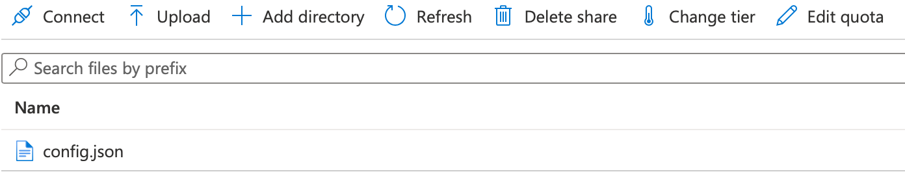
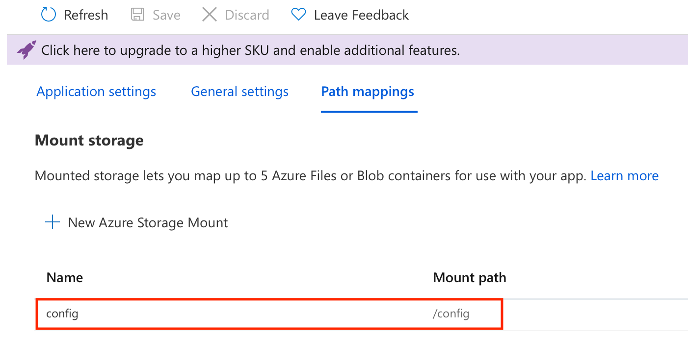

# Broadcast Bot for Webex
The Bot can be used to broadcast a Webex message or [Card](https://developer.webex.com/docs/buttons-and-cards) to
multiple Spaces. For example an important notification or a marketing information.
The Bot replicates a received message to a set of Spaces or 1-1 communications it is a member of.
The set of spaces is determined by Bot's configuration. It can be:
- all Spaces the Bot is member of
- only the Spaces which are owned by the message author's Webex Org
- only the Spaces which are owned by the Bot's Org

Furthermore the message author is checked. It can be:
- anyone
- anyone from the Bot's Org
- only a person from the configured list of authors

Additionally the Bot can be configured to limit it's membership only to its own Org.
If it is invited to a Space owned by different Org, it posts a message that it is not allowed
to be a member of external Spaces and leaves.

The Bot can be hosted as a publicly accessible [Webhook](https://developer.webex.com/docs/webhooks), for example
on [AWS Lambda](https://aws.amazon.com/lambda/) or [Azure function](https://learn.microsoft.com/en-us/azure/azure-functions/) to name a few.

The [Card](https://developer.webex.com/docs/buttons-and-cards) can be created using [Card Designer](https://developer.webex.com/buttons-and-cards-designer).

## How it works
The Bot subscribes its Webhook URL to multiple Webex events:
- new message created
- Space membership created, deleted or updated
### Message broadcast
If the Bot receives a message in 1-1 communication (preferred way) or via @mention in a Space it runs following algorithm:
1. check the message sender against Bot's configuration
2. get the list of Bot's membership in Spaces and 1-1 communications
3. use Bot's configuration to determine to which Spaces to replicate the message

The message is then replicated this way:
1. sender's identity is added to the beginning of the message
2. if there is a file attached, only the first file is replicated for broadcast (it is a limitation of [Webex API](https://developer.webex.com/docs/api/v1/messages/create-a-message))
3. if the attached file type is JSON, the Bot attempts to send it as a [Card](https://developer.webex.com/docs/buttons-and-cards). If it fails, the file is sent as a normal attachment.
### Space membership
Once the Bot is added to a Space, it checks the `membership` part of its configuration for `bots_own_org` parameter.
If the parameter is `true`, it checks the ownership of the Space to which it was added. If the Space is owned by a
different Webex Org than the Bot's own, the Bot posts a message that it is not allowed to take part in communication
outside its own Org. Otherwise it silently accepts the membership.  
There is one more special case - a Space in **announcement mode**. In this case the Bot sends a 1-1 message
to the person who added it to the Space, that it needs to be promoted to a Space moderator. Otherwise it won't
be able to send messages in the Space.
### Configuration
There is [default_config.json](default_config.json) which can be replaced by a file specified in **CONFIG_FILE**
environment variable. The configuration has following sections:
1. **source** - determines the sender's check criteria:
* **bots_own_org** - only senders from the Bot's Org are accepted
* **from_sender_list** - if it is `true`, only the members of **sender_list** are accepted
2. **destination** - determines the destination Space selection criteria:
* **bots_own_org** - only the Spaces owned by Bot's Org are selected for message replication
* **senders_own_org** - only the Spaces from sender's Org are selected
3. **membership** - determines the Bot Space membership criteria:
* **bots_own_org** - Bot accepts only the membership in Spaces owned by its Org

##How to install
### Create a Webex Bot account
a) Login to https://developer.webex.com  
b) Click on the user's icon in the top right corner and select **My Webex Apps**  
c) Create a **Bot**. Note that Bot's e-mail address has to be unique across all Webex users, so include some org-specific info like `adams.broadcast.bot@webex.bot`.  
d) Save **Bot Access Token** in a safe place, later you will copy it to **WEBEX_TEAMS_ACCESS_TOKEN** environment variable.

###Install the Bot code
Install the code in a serverless environment of your choice. Bot is written in Python 3 using Flask WSGI. It was tested
with Python version 3.9. Required modules are in [requirements.txt](requirements.txt).

###Configuration
Create a copy of [default-config.json](default-config.json), for example **config.json**. Set the configuration
parameters as you wish. For example when hosting the Bot on Azure, create a file storage and save the config.json there.
Then map the storage to the application. In the example below, the file is accessible to Bot at **/config/config.json**.
  

  
Following environment variables need to be set:
1. **WEBEX_TEAMS_ACCESS_TOKEN** - contains the Bot access token
2. **CONFIG_FILE** - contains the path to the configuration file
